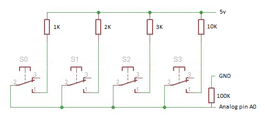

## Irrigation Control System

An autonomous irrigation control system on Arduino with an 4x20 LCD screen, real time clock, custom resistor button controller and custom menu with blinking items when selected. It’s fully programmable from the user and completely expandable.

### Points of interest

* You can navigate the menu with a six button controller (Up, Down, Right, Left, Enter, Back). The exciting part is that only 1 GPIO pin is used. The circuit is similar to the example bellow.

* The selected item in the menu (where the cursor is) is indicated with blinking of the item. This is achieved with the function Blinkable in [Blinking.ino](source/irrigation_control_system/Blinking.ino). This function either displays a string on the screen constantly or (if it's state parameter is true) the string blinks with a constant interval.

* Whenever an alarm is created by the user, the key information is saved to the EEPROM. In case of power outage or a force reset of the system, the alarms are automatically restored.
